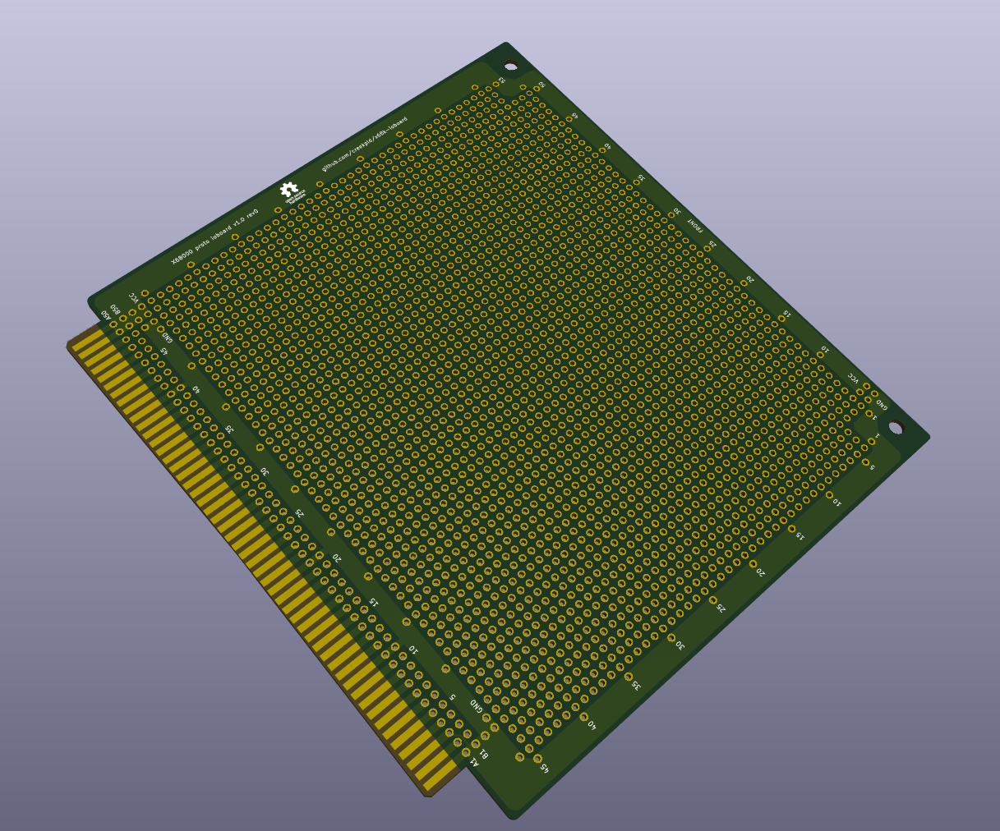

# x68k-ioboard

An IO-Expansion Prototype PCB Board for the [X68000](https://en.wikipedia.org/wiki/X68000).

## Hardware

Made with KiCAD v5.1.6

## Production notes

- do not use [HASL](https://en.wikipedia.org/wiki/Hot_air_solder_leveling) use [ENIG](https://en.wikipedia.org/wiki/Electroless_nickel_immersion_gold) instead
- Chamfer card edge by 2mm with 20° angle (2X20°)

## Acknowledgments

Inspired by the [Sunhayato MMC-169](img/MMC-169-Back.jpg)